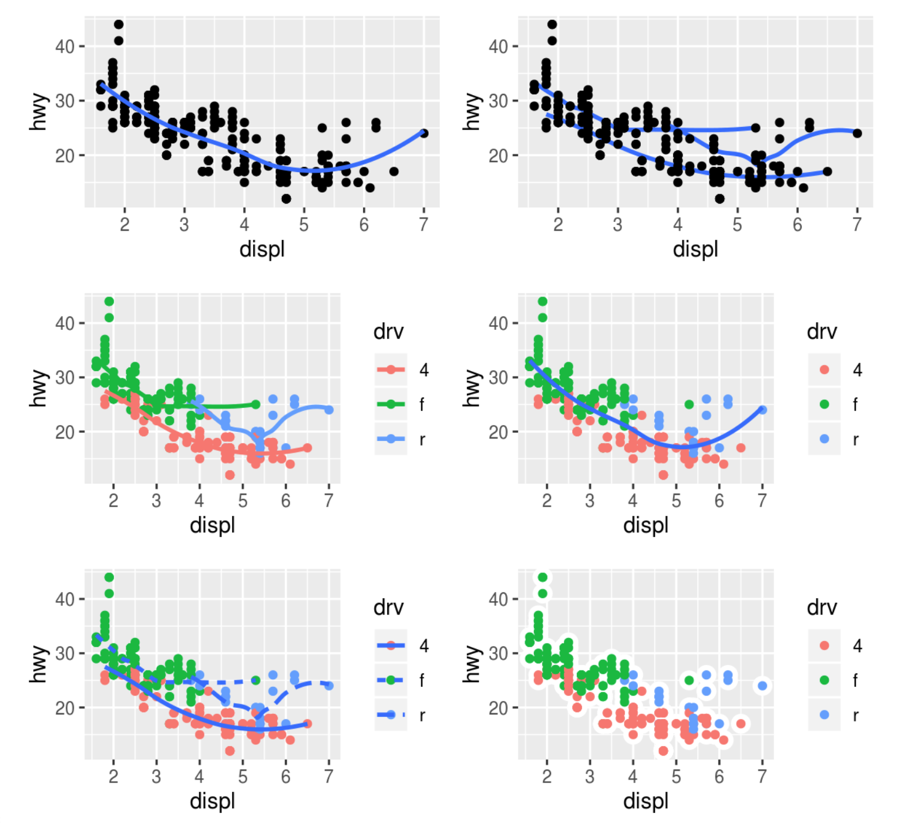

# Introduction to R - EXERCISES

## Contents

1. [Prerequisites](#prerequisites)
2. [Data visualisation](#data-visualisation)
3. [Data transformation](#data-transformation)

---
### Prerequisites

1. Try to predict what logical (TRUE, FALSE or NA) the following expressions return, and explain why.
```R
FALSE == FALSE
FALSE != TRUE
TRUE & FALSE
TRUE | FALSE

NA > 5
10 == NA
NA + 10
NA ^ 0
NA * 0

NA == NA
NA | TRUE
NA | FALSE
NA & TRUE
NA & FALSE

sqrt(2) ^ 2 == 2
1 / 49 * 49 == 1
near(sqrt(2) ^ 2, 2)
```

---
### Data visualisation

1. Recreate the R code necessary to generate the following graphs.



2. What is the default geom associated with `stat_summary()`? How could you rewrite the [previous plot](Tidyverse.md#data-visualisation) (depth vs cut) to use that geom instead of the stat function?

[Visualisation cheatsheet](cheatsheets/data-visualization-2.1.pdf) can be of help.

---
### Data transformation

1. Find all flights that
  a) Had an arrival delay of two or more hours.
  b) Flew to Houston (IAH or HOU).
  c) Were operated by United, American or Delta.
  d) Departed in summer (June, July and August).
  e) Arrived more than two hours late, but didn't leave late.
  f) Were delayed by at least an hour, but made up over 30 minutes in flight.
  g) Departed between midnight and 6am (inclusive).

2. a) How would you sort all missing values in `dep_time` to the start?
   b) Sort flights to find the most delayed flights.
   c) Find the flights that left the earliest.
   d) Find the fastest flights (by average air speed).

3. a) Convert `dep_time` and `sched_dep_time` to number of minutes since midnight, which is an easier representation to compute with.
   b) EXTRA (hard). How would you expect `dep_time`, `sched_dep_time` and `dep_delay` to be related? Show it for all cases.
   c) EXTRA (very hard and long). How would you expect `air_time`, `arr_time` and `dep_time` to be related? Show it for all cases, if possible.

4. a) Plot the distribution of average delays by individual planes (identified by their tail number). Compare doing so with `geom_freqpoly()` and `geom_point()`.
   b) Look at the number of cancelled flights per day. Is there a pattern? Is the proportion of cancelled flights related to the average delay?
   c) Which plane has the worst on-time record? (Delayed the most.)
   d) At what hour of day should you fly if you want to avoid delays as much as possible?
   e) Delays are typically temporally correlated: even once the problem that caused the initial delay has been resolved, later flights are delayed to allow earlier flights to leave. Using `lag()`, explore how the delay of a flight is related to the delay of the immediately preceding flight.
   f) Find all destinations that are flown by at least two carriers. Use that list of destinations to rank the carriers by the number of destinations they serve.
   g) For each plane, count the number of flights before the first delay of greater than 1 hour.

---
### License

This material is released under a
[CC-BY-NC-SA license](https://creativecommons.org/licenses/by-nc-sa/4.0/) .
